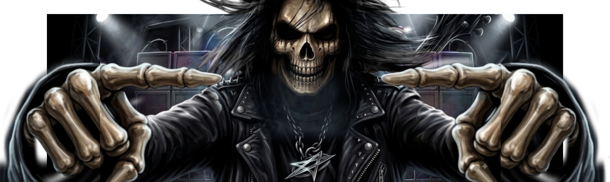

<div align="right">
  <a href="./README.md">
    
  </a>
  <a href="./README.en.md">
    
  </a>
</div>

<div align="center">




</div>

---

## ZASK AI CORE

```bash
╭────────────────────────────╮
│        ZASK SYSTEM v2.0         │
╰────────────────────────────╯

Initializing system...

████████████████████ 100%

✔ Developer detected
✔ Creativity enabled
✔ Code engine activated
✔ Projects loaded

STATUS: ONLINE 🚀
```

---

## About Me

```javascript
const Izhac = {

 nome: "Izhac Nylton",

 função: "Full Stack Developer",

 localidade: "Amazonas, Brazil 🇧🇷",

 stack: {
    frontend: [
      "JavaScript",
      "HTML",
      "CSS"
    ],

    backend: [
      "Python",
      "Java",
      "PHP",
      "C"
    ],

    database: [
      "MySQL"
    ]
 },

 tools: [
   "Git",
   "GitHub",
   "VS Code",
   "Eclipse"
 ],

 foco:
 "Building Digital Experiences"

}
```

---

## Tech Stack

<div align="center">


</div>

---

## Featured Projects

|  Project |  Description |
|---|---|
| Empty :(

---

## Current Mission

```bash
> Loading objectives...

[███████░░░] Java Development

[██████████] Backend Skills

[████████░░] Frontend Skills

[███████░░░] Creating Projects

STATUS:
Never stop learning 
```

---

## Connect With Me 😛

<div align="center">

<a href="https://github.com/izhacnylton">

</a>

<a href="https://youtu.be/dQw4w9WgXcQ?is=1Llcp4cytHGOdOwE">

</a>

</div>

---

<div align="center">

### "Turning ideas into code and code into experiences."


</div>


